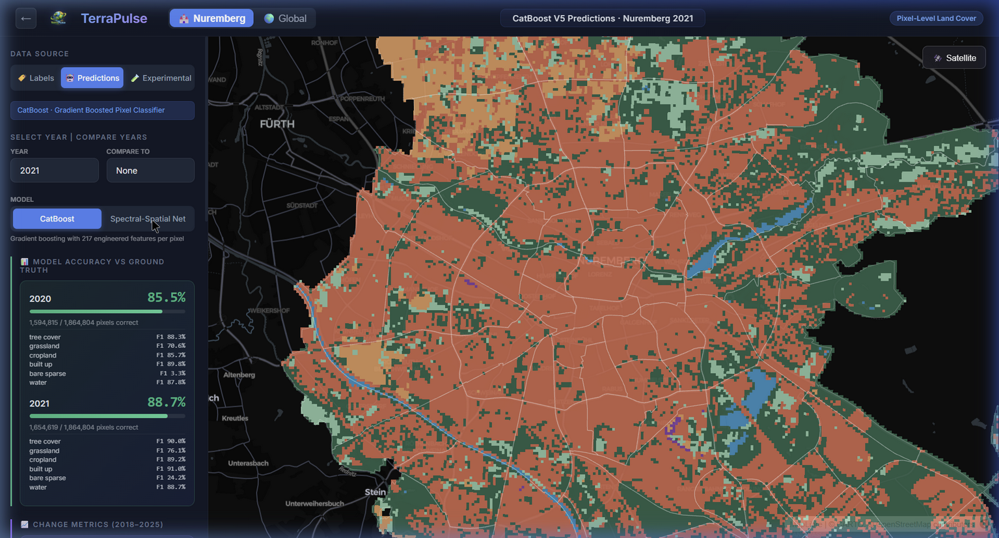
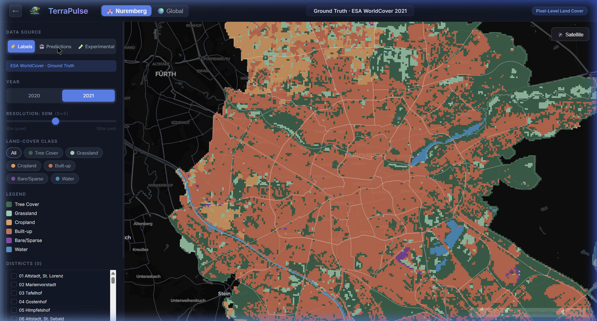
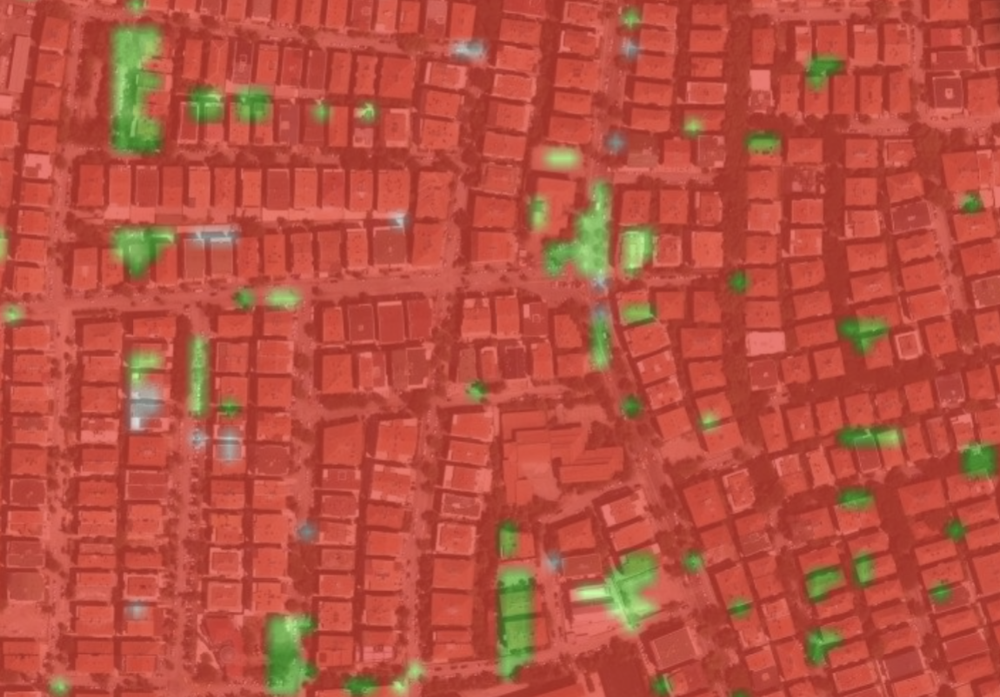
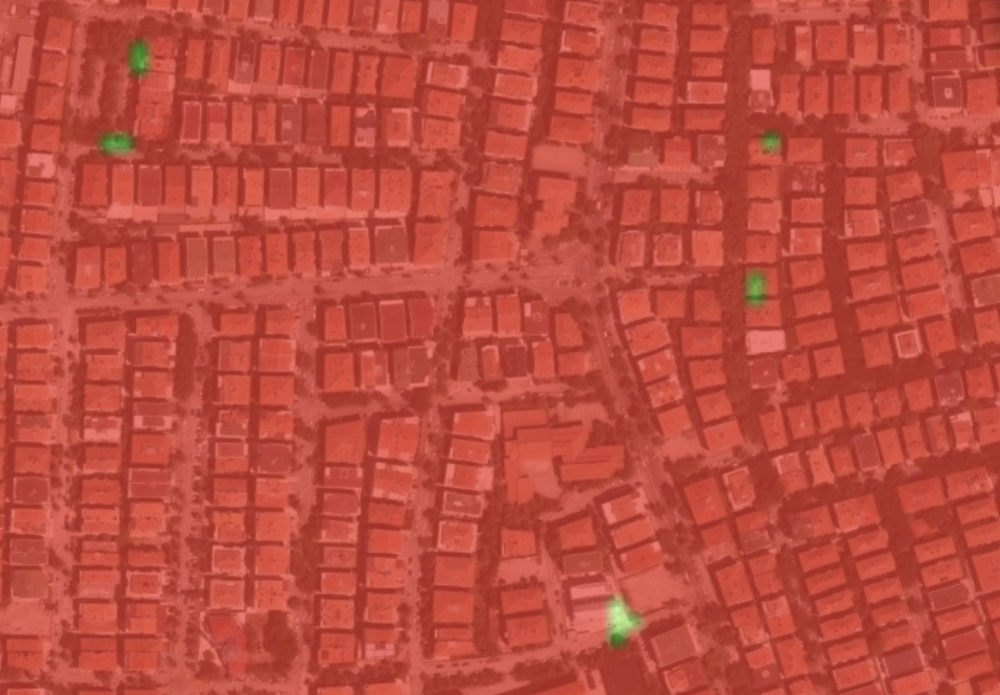
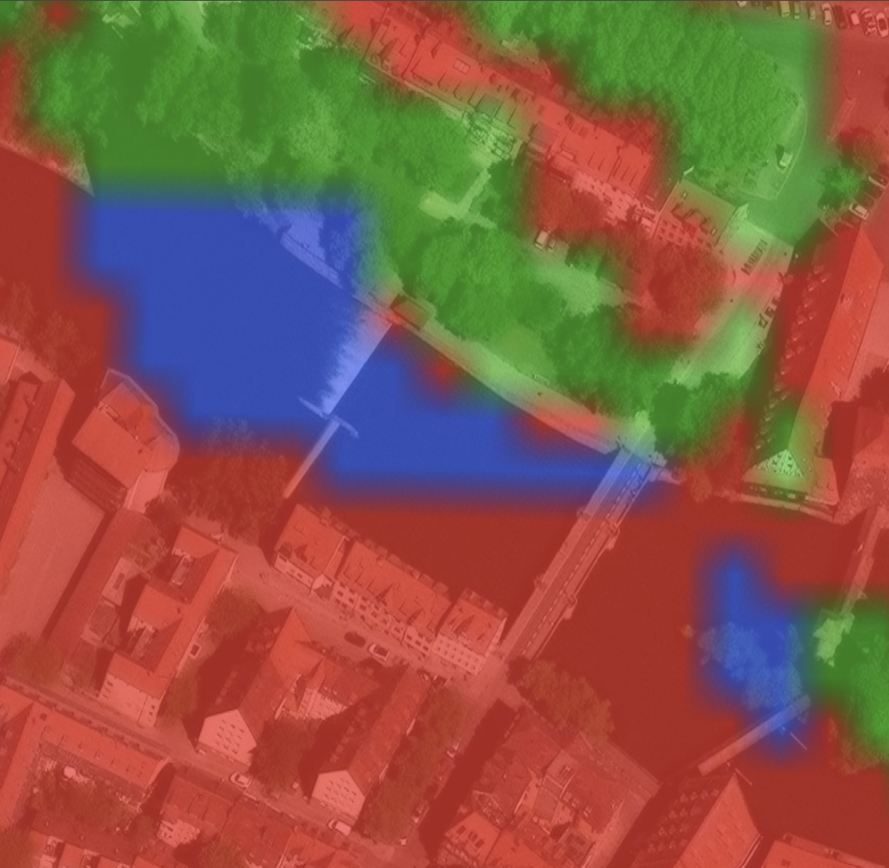
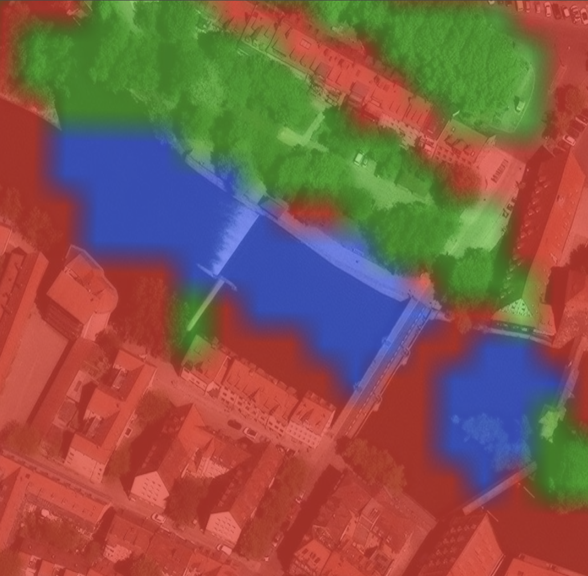
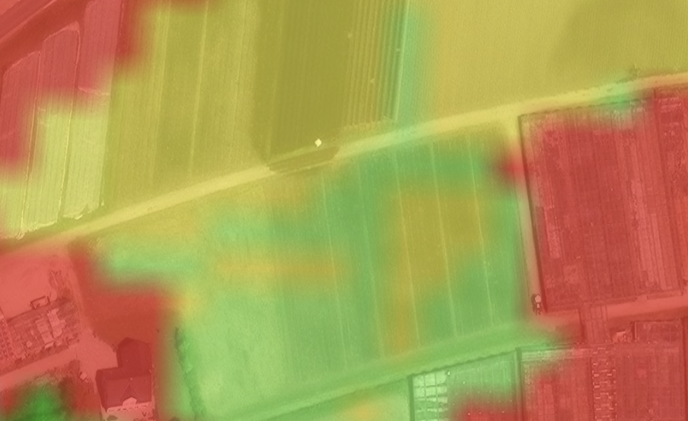
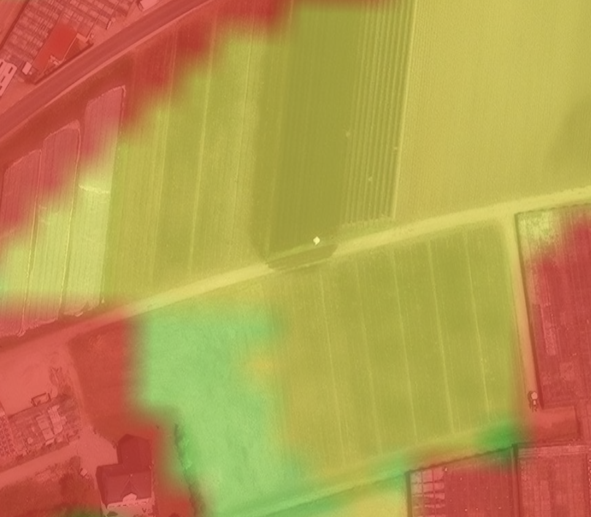

<p align="center">
  
  <h1 align="center">Tessera</h1>
  <p align="center">
    <strong>Satellite-to-Map: Predicting Land Cover from Space</strong>
  </p>
  <p align="center">
    Sentinel-2 & Sentinel-1 imagery → ML models → interactive dashboard
  </p>
</p>

<p align="center">
  <a href="https://terrapulse.calmglacier-f6008cba.germanywestcentral.azurecontainerapps.io/">🌍 Live Demo</a> •
  <a href="#models">Models</a> •
  <a href="#dashboard">Dashboard</a> •
  <a href="#quickstart">Quickstart</a> •
  <a href="#architecture">Architecture</a> •
  <a href="#case-studies">Case Studies</a> •
  <a href="#reproduction">Reproduction</a>
</p>

---

## What is Tessera?

Tessera is a machine learning system that predicts **land-cover composition** and **land-cover change** using satellite imagery. It classifies every 10m × 10m area on Earth into land-cover types — tree cover, grassland, cropland, built-up, bare/sparse vegetation, and water — and visualizes the results through an interactive dashboard.

Built around a **Rust inference engine** for speed and a **React + deck.gl** frontend for visualization, the system processes raw satellite data end-to-end: download → cloud masking → feature extraction → ONNX inference → interactive map.

<p align="center">
  
</p>
<p align="center"><em>CatBoost pixel-level predictions for Nuremberg with per-class F1 scores and accuracy metrics</em></p>

---

## Models

Tessera uses five models, each serving a different purpose:

| Model | Type | Purpose | Accuracy |
|-------|------|---------|----------|
| **CatBoost** | Gradient Boosted Trees | Pixel-wise land-cover (10m) for Nuremberg | 88.7% (2021 vs ESA) |
| **Spectral-Spatial Net** | Deep Neural Network | Pixel-wise classification with 3×3 spatial context | 93% agreement with CatBoost |
| **Global MLP** | Tapered MLP (ONNX) | 100m cell-level predictions anywhere on Earth | 90.2% Top-1 across 6 test cities |
| **Change RF** | Random Forest | Binary change-likelihood heatmap | 98.7% precision |
| **Future Labels RF** | Random Forest | Predicted next-year land-cover class | ~90% accuracy |

### CatBoost — Feature-Engineered Pixel Classifier

The primary Nuremberg model. Trained on **15 million pixels** from 100 European cities (Nuremberg entirely held out), using 217 features per pixel: 10 Sentinel-2 bands, 9 spectral indices, 3 SAR features across 6 temporal slots (2 years × 3 seasons), plus temporal difference and growing-season features.

Key design decisions:
- **Symmetric trees** (depth 8) — CatBoost's balanced tree structure makes inference significantly faster than LightGBM/XGBoost asymmetric trees, critical when predicting millions of pixels
- **Inverse-frequency class weights** — compensates for heavy label imbalance (tree cover and cropland dominate)
- **Geographic hold-out** — the model never sees Nuremberg during training or validation, so all dashboard predictions are genuinely out-of-sample

### Spectral-Spatial Net — Deep Pixel Classifier

A convolutional neural network that operates directly on raw spectral bands with a 3×3 pixel spatial context window. Unlike CatBoost, this model learns its own feature representations rather than relying on hand-engineered indices.

The network uses **prior-guided center loss** during training — a custom loss function that weights the center pixel more heavily than its spatial neighbors and incorporates class-distribution priors computed from the training data. This prevents the model from simply copying the majority class in each neighborhood.

Trained with mixed-precision (FP16) on GPU with explicit fp32 dtype casts in the loss function to prevent autocast errors with IndexPut operations.

### Global MLP — Predict Anywhere on Earth

A TaperedMLP (1024→512→256→64, GELU, ~2.5M parameters) that predicts **class-fraction distributions** for 100m × 100m cells worldwide. Exported to ONNX and embedded in the Rust inference binary for zero-Python-dependency deployment.

- **1,764 features per cell**: spectral bands & indices, tasseled cap, spatial statistics (Sobel, Laplacian, Moran's I), multi-band LBP textures, SAR backscatter, and phenological descriptors
- **Soft cross-entropy loss**: learns fractional class labels directly since 100m cells contain mixed land cover
- **BOHB hyperparameter sweep**: Bayesian Optimization + HyperBand across 100+ trial configurations

**Test results** (6 held-out cities: Nuremberg, Ankara, Sofia, Riga, Edinburgh, Palermo):

| Metric | Value |
|--------|-------|
| Top-1 Accuracy | 90.2% |
| R² (5% threshold) | 0.676 |
| Best per-class R² | Water: 0.97, Tree: 0.93, Built-up: 0.91 |

### Stress Testing the Global MLP

The model was rigorously stress-tested across three dimensions:

- **Gaussian noise injection**: Degrades gracefully up to σ=0.2 (R² 0.676→0.653), then collapses at σ=2.0 (R² = −0.24)
- **Season dropout**: Removing any single 2021 season significantly degrades performance (p<0.05), but 2020 seasons can be dropped without significant impact — the model correctly weights the label year more heavily
- **Feature ablation**: Spectral indices are critical (removing them collapses R² to −0.96). Phenological features disproportionately affect Top-3 accuracy (74%→51.5%). LBP and spatial features show no individually significant contribution but jointly contribute to peak performance

---

## Dashboard

**[→ Try the live demo](https://terrapulse.calmglacier-f6008cba.germanywestcentral.azurecontainerapps.io/)**

<p align="center">
  
</p>
<p align="center"><em>ESA WorldCover ground truth labels with resolution slider, class filters, and district overlay</em></p>

### Nuremberg Tab

Pixel-level exploration of the Nuremberg study area (29,946 grid cells):

- **Labels / Predictions / Experimental** — switch between ground truth, model predictions (CatBoost or Spectral-Spatial Net), and change heatmaps
- **Time slider** — view predictions for any year from 2018 to 2025
- **Resolution slider** — aggregate pixel predictions from 10m (native) to 100m (cell-level)
- **Year comparison** — select two years to visualize which pixels changed class
- **Model selector** — toggle between CatBoost and Spectral-Spatial Net with live accuracy metrics
- **District interaction** — hover and click on Nuremberg's 87 statistical districts with socioeconomic context

### Global Tab

Live prediction for any bounding box worldwide:

1. Draw a region or enter coordinates
2. The Rust pipeline downloads Sentinel-2/1 imagery, extracts 1,764 features, runs ONNX inference
3. View predictions with comparison against WorldCover labels
4. Real-time progress updates for each pipeline stage
5. Model evaluation panel with per-class R², confusion matrices, and stress test results

---

## Case Studies

### Ankara: Urban Tree Classification

A revealing test case. Ankara's residential neighborhoods feature trees planted between apartment buildings. ESA WorldCover labels these areas as **tree cover** (green), but our Spectral-Spatial Net correctly classifies them as **built-up** (red) — because structurally, they are urban areas with incidental vegetation, not forests.

<p align="center">
  
  
  
</p>
<p align="center"><em>Left: Google Street View showing trees between buildings. Center: ESA labels (green = tree). Right: Our model (red = built-up). The model recognizes that scattered trees within an urban grid don't make it a forest.</em></p>

This demonstrates that lower agreement with ESA labels doesn't necessarily mean worse performance — the model has learned to reason about underlying land use, not just spectral greenness.

### Water Canal Detection

Thin water canals present a classification challenge: they contain varying amounts of built-up infrastructure, their depth affects water color, and they're often partially obscured by surrounding vegetation. Our Spectral-Spatial Net detects **more water area** than ESA labels, particularly along canal edges and shallow sections.

<p align="center">
  
  
</p>
<p align="center"><em>Left: ESA labels. Right: Spectral-Spatial Net — classifies more water (blue) along canals and toward shallow edges.</em></p>

### Grassland vs. Cropland Separation

Distinguishing grassland from cropland is notoriously difficult from single-date imagery. Our model leverages **seasonal temporal features** (NDVI differences between spring and summer, growing-season range) to better separate cropland, which shows strong seasonal variation, from permanent grassland.

<p align="center">
  
  
</p>
<p align="center"><em>Left: ESA labels show mixed grassland (green) and cropland (yellow). Right: Our model — cleaner cropland delineation thanks to multi-season temporal features that capture harvest cycles.</em></p>

---

## Architecture

```
┌─────────────────────────────────────────────────────────────────────┐
│                        Tessera Architecture                        │
├─────────────────────────────────────────────────────────────────────┤
│                                                                     │
│   ┌──────────────┐    ┌──────────────┐    ┌──────────────────────┐  │
│   │  Sentinel-2  │    │  Sentinel-1  │    │  ESA WorldCover 10m  │  │
│   │  L2A (10m)   │    │  GRD (SAR)   │    │  (Ground Truth)      │  │
│   └──────┬───────┘    └──────┬───────┘    └──────────┬───────────┘  │
│          │                   │                       │              │
│          ▼                   ▼                       ▼              │
│   ┌──────────────────────────────────────────────────────────────┐  │
│   │                  Rust Pipeline (terrapulse)                  │  │
│   │  Download → Cloud Mask → Composite → Extract → ONNX Predict │  │
│   │  tokio (async I/O) + rayon (parallel CPU) + ort (inference)  │  │
│   └──────────────────────────┬───────────────────────────────────┘  │
│                              │                                      │
│                              ▼                                      │
│   ┌──────────────────────────────────────────────────────────────┐  │
│   │                 FastAPI Backend (Python)                     │  │
│   │  REST API · Serves pre-computed bins · Spawns Rust pipeline  │  │
│   └──────────────────────────┬───────────────────────────────────┘  │
│                              │                                      │
│                              ▼                                      │
│   ┌──────────────────────────────────────────────────────────────┐  │
│   │            React + deck.gl Frontend                          │  │
│   │  MapLibre GL · GPU-accelerated WebGL · Chart.js metrics      │  │
│   └──────────────────────────────────────────────────────────────┘  │
│                                                                     │
│   Deployment: Docker (multi-stage) → Azure Container Apps          │
│   CI/CD: GitHub Actions → GitHub Container Registry                │
└─────────────────────────────────────────────────────────────────────┘
```

### Tech Stack

| Layer | Technology |
|-------|-----------|
| **Inference Pipeline** | Rust (tokio, reqwest, rayon, ort) — ~6,500 LOC |
| **ML Inference** | ONNX Runtime |
| **Backend** | Python, FastAPI, Uvicorn |
| **Frontend** | React 19, Vite, MapLibre GL, deck.gl, Chart.js |
| **Pixel Model** | CatBoost (GPU, CUDA) |
| **Deep Pixel Model** | PyTorch (mixed-precision FP16), custom SpectralSpatialNet |
| **Global Model** | PyTorch → ONNX (TaperedMLP, 2.5M params) |
| **Change Models** | scikit-learn Random Forest + Logistic Regression |
| **Container** | Docker multi-stage: Rust build → Node.js build → Python runtime |
| **CI/CD** | GitHub Actions → GHCR |
| **Deployment** | Azure Container Apps (Germany West Central, co-located with Planetary Computer) |
| **Data Sources** | Sentinel-2 L2A, Sentinel-1 GRD, ESA WorldCover 10m (via Planetary Computer STAC API) |

---

## Quickstart

### Option 1: Docker (recommended)

```bash
docker pull ghcr.io/ivanyachukr/terrapulse:latest
docker run -p 8000:8000 ghcr.io/ivanyachukr/terrapulse:latest
# Open http://localhost:8000
```

The Docker image is self-contained: Rust binary, ONNX model, frontend build, precomputed Nuremberg data, and API server.

### Option 2: Build from source

**Prerequisites:** Rust 1.83+, Python 3.12+, Node.js 22+

```bash
git clone https://github.com/IvanYachUkr/Tessera.git
cd Tessera

# Build the Rust binary
cd terrapulse && cargo build --release && cd ..

# Install Python dependencies
python -m venv .venv
source .venv/bin/activate          # Linux/Mac
# .venv\Scripts\activate           # Windows
pip install -r requirements-docker.txt

# Build the frontend
cd src/dashboard/frontend && npm ci && npm run build && cd ../../..

# Start the server
python -m uvicorn src.dashboard.api:app --port 8000
```

### Option 3: Development mode

```bash
# Terminal 1: API server
python -m uvicorn src.dashboard.api:app --port 8000 --reload

# Terminal 2: Frontend dev server (hot reload)
cd src/dashboard/frontend && npm run dev
# Frontend at http://localhost:5173, proxying API to :8000
```

---

## Feature Engineering

All models share a feature pipeline built on **Sentinel-2 L2A surface reflectance** (10 bands: B02–B08, B8A, B11, B12).

### Spectral Indices (15 total)

| Category | Indices | Purpose |
|----------|---------|---------|
| Vegetation | NDVI, EVI2, SAVI, GNDVI | Vegetation vigor and chlorophyll |
| Red-edge | NDRE1, NDRE2, IRECI, CRI1 | Shrubland/grassland separation |
| Water | NDWI, MNDWI | Open water detection |
| Surface | NDBI, NDMI, NBR, BSI, NDTI | Built-up, moisture, bare ground, tillage |

### Additional Feature Groups

- **Tasseled Cap**: Brightness, Greenness, Wetness (Nedkov 2017 coefficients)
- **Spatial statistics**: Sobel edge magnitude, Laplacian, Moran's I on NIR
- **Local Binary Patterns**: Rotation-invariant uniform LBP on NIR, NDVI, EVI2, SWIR1, NDTI (55 features/season)
- **SAR features**: VV/VH backscatter, cross-pol ratio, Radar Vegetation Index, temporal statistics
- **Temporal features**: Intra-annual diffs (spring→summer, summer→autumn), inter-annual diffs (2020→2021), growing-season range
- **Phenological descriptors**: Seasonal amplitude, peak season, slope, curvature

### Features Tried and Rejected

GLCM texture, Gabor wavelets, HOG, morphological profiles, semivariograms, and OSM features were all implemented and tested. Each was rejected for specific reasons — GLCM/Gabor/HOG require larger spatial context than 10×10 pixel patches provide, morphological profiles collapsed to near-constant values, semivariogram fits were unstable, and OSM data violates the self-contained pipeline design goal.

---

## Data Sources

All data is **publicly available** with no authentication required:

| Source | Resolution | Usage |
|--------|-----------|-------|
| [Sentinel-2 L2A](https://planetarycomputer.microsoft.com/) | 10–20m optical | Primary input (all models) |
| [Sentinel-1 GRD](https://planetarycomputer.microsoft.com/) | 10m SAR | Weather-independent texture features |
| [ESA WorldCover](https://esa-worldcover.org/) | 10m | Ground truth labels (2020, 2021) |

---

## Reproduction

Complete scripts for reproducing all models are in `reproduce/`. Each subdirectory has its own README.

### Hardware Requirements

- **RAM**: 32 GB minimum
- **GPU**: NVIDIA with 6+ GB VRAM (tested on RTX 4070)
- **Storage**: ~300 GB for raw imagery
- **Data download**: ~48 hours (Planetary Computer rate limits)

### MLP Model (Global)

```bash
pip install torch --index-url https://download.pytorch.org/whl/cu124
pip install -r reproduce/requirements.txt

python reproduce/mlp/01_download_data.py       # Download satellite data
python reproduce/mlp/02_extract_features.py     # Build feature matrices
python reproduce/mlp/04_train_model7.py         # Train deployed model (~2h)
python reproduce/mlp/05_evaluate_test.py        # Evaluate on 6 test cities
python reproduce/mlp/06_export_onnx.py          # Export to ONNX
```

### CatBoost Model (Pixel)

```bash
python reproduce/pixel/01_download_data.py      # Same data (skip if done)
python reproduce/pixel/02_train_catboost.py     # Train 4 configs (~1-2h GPU)
python reproduce/pixel/03_predict_nuremberg.py  # Generate dashboard bins
```

### Spectral-Spatial Net

```bash
python reproduce/models/train_ssnet_v8.py       # Train with prior-guided loss
python reproduce/models/predict_nuremberg_v8.py  # Generate dashboard bins
```

---

## Repository Structure

```
Tessera/
├── terrapulse/                        # Rust inference pipeline (~6,500 LOC)
│   └── src/
│       ├── main.rs                    # CLI: download, extract, predict, pipeline
│       ├── composite.rs               # Cloud masking & seasonal compositing
│       ├── cog.rs                     # Zero-dependency Cloud-Optimized GeoTIFF reader
│       ├── features.rs                # Feature computation (indices, LBP, spatial stats)
│       ├── predict.rs                 # ONNX Runtime inference (chunked)
│       └── ...                        # 14 more modules
│
├── src/dashboard/
│   ├── api.py                         # FastAPI backend
│   ├── data/nuremberg_dashboard/      # Pre-computed prediction bins (8 years × 10 resolutions)
│   └── frontend/src/
│       ├── App.jsx                    # Main app with tab routing
│       └── components/
│           ├── NurembergMapView.jsx   # Pixel-level map (labels, predictions, heatmap)
│           ├── DeployView.jsx         # Global deployment map
│           ├── Sidebar.jsx            # Controls & model metrics
│           └── ...
│
├── reproduce/                         # Full training reproduction
│   ├── mlp/                           # Global MLP pipeline (6 scripts)
│   ├── pixel/                         # CatBoost pipeline (3 scripts)
│   └── models/                        # Spectral-Spatial Net architecture & training
│
├── data/pipeline_output/models/onnx/  # Deployed ONNX model + scaler
├── docs/                              # CLI, deployment, and data documentation
├── Dockerfile                         # Multi-stage build (Rust → Node → Python)
└── .github/workflows/ci.yml           # CI/CD pipeline
```

---

## Known Limitations

1. **Ground truth quality**: ESA WorldCover labels are themselves ML predictions (~76.7% accuracy). Our models learn to replicate WorldCover's biases — predicting the output of another ML model, not absolute ground truth.

2. **Change prediction data**: Only two years of labels (2020, 2021) are available, and they were generated by _different_ ESA algorithms, creating artificial "changes" that are model artifacts rather than real land-cover transitions.

3. **Rare classes**: Bare/sparse vegetation and shrubland are extremely rare in Nuremberg. Cross-referencing with LUCAS 2022 in-situ survey data showed >50% disagreement for bare land labels.

4. **Seasonal dependency**: Winter months in Central Europe have prohibitively high cloud cover, making the system effectively limited to spring–autumn composites.

---

## Documentation

| Document | Contents |
|----------|----------|
| [CLI.md](docs/CLI.md) | Standalone Rust binary usage |
| [DEPLOY.md](docs/DEPLOY.md) | Docker & Azure deployment |
| [DOWNLOAD.md](docs/DOWNLOAD.md) | Downloading satellite imagery |
| [WorldCover mapping](docs/worldcover_class_mapping.md) | ESA 11→7 class remap |

---

## License

This project is licensed under the MIT License. See [LICENSE](LICENSE) for details.
